# Instalacion de APACHE2, MYSQL, PHP Y PHPMYADMIN.
Para poder empezar con la instalación primero debemos actualizar los paquetes.

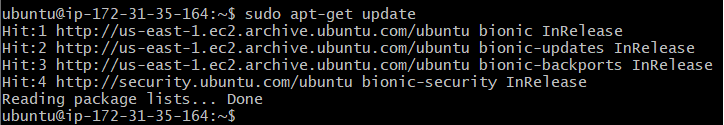

Una vez actualizado podemos comenzar con las siguientes instalaciones:

  - [Instalar Apache2](#instalar-apache2)
  - [Instalar MySQL](#instalar-mysql)
  - [Instalar PHP](#instalar-php)
  - [Instalar phpmyadmin](#instalar-phpmyadmin)

## Instalar Apache2

Comenzaremos con el comando para instalar Apache2:

    sudo apt install apache2
   
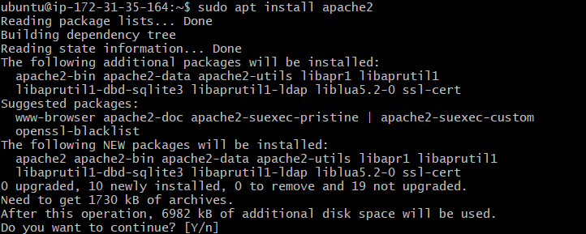

Para comprobar que funciona correctamente primero accederemos al **wizard de AWS** para comprobar que HTTP y HTTPS están habilitados:

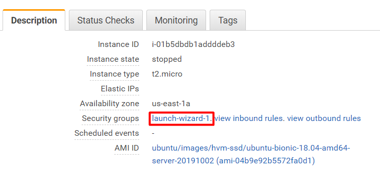

Una vez aquí clickaremos en `Edit`:

Para acabar, con `Add rule` añadiremos una regla nueva donde seleccionaremos **HTTP** en la sección de tipo. Repite este paso para añadir **HTTPS**:

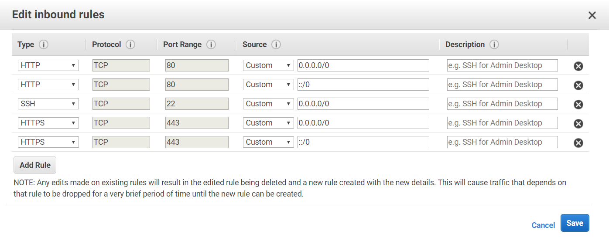

Ahora ya podemos comprobar si la instalación del Apache2 se ha hecho de manera correcta, para ello escribe lo siguiente en tu navegador:

    http://ip_de_tu_servidor o http://dns_de_tu_servidor
    

Pudes encontrar tu ip o dns en esta sección una vez que la máquina está encendida:

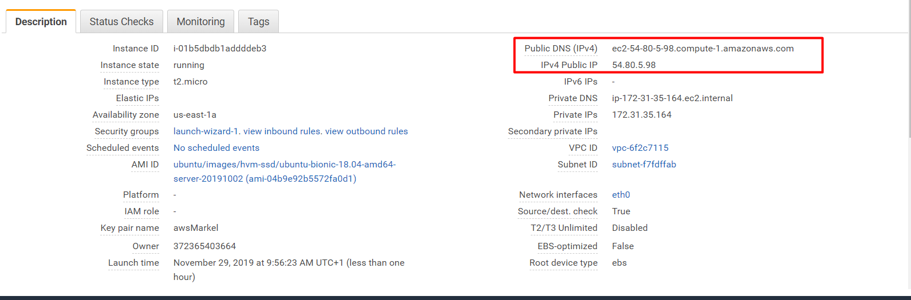

## Instalar MySQL

Una vez mas, empezaremos con el comando de instalación, en este caso para MySQL:

    sudo apt-get install mysql-server mysql-client
    

Con este comando instalaremos tanto el servidor como el cliente de MySQL.

Al finalizar la instalación ejecutaremos el siguiente comando:

    sudo mysql_secure_installation
    

Con este comando borraremos algunos parametros peligrosos y aseguraremos el acceso ala base de datos.

Después te pedirá que completes unos pasos. Hazlo de la siguiente manera:

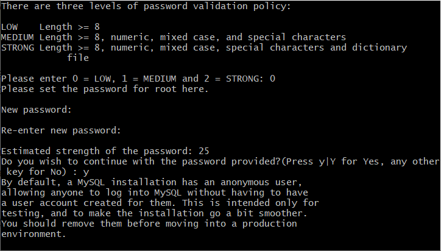

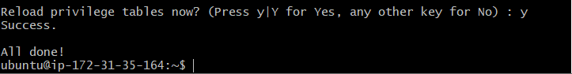

Si quisieras comprobar tu versión de **MySQL** puedes hacerlo con esté comando:

    mysql --version
    
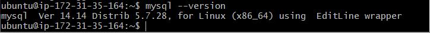

## Instalar PHP

Ahora toca instalar **PHP**, para ello comenzaremos con el comando de instalación de nuevo:

    sudo apt install php libapache2-mod-php php-mysql

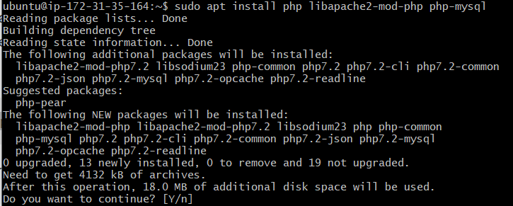

Si tus archivos van a ser de tipo **.php** es recomendable que modifiques el archivo **dir.conf** para dar prioridad a dicho tipo de archivos.

Para conseguir esto ejecutaremos el siguiente comando:

    sudo nano /etc/apache2/mods-enabled/dir.conf
    

Con esto te saldra algo como esto:

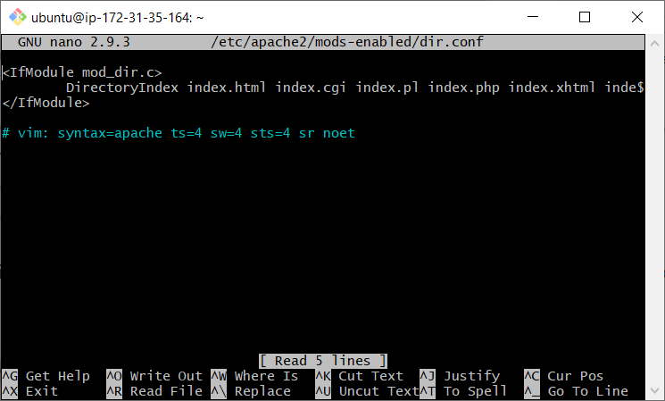

Cambiaremos de sitio el archivo **index.php** colocándolo en primer lugar y lo guardaremos con `Ctrl+o` y saldremos con `Ctrl+x`:

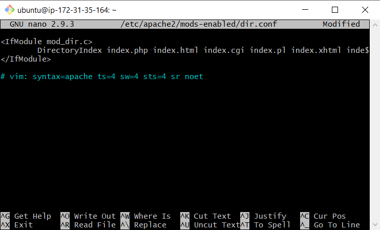

Seguidamente reiniciaremos el servicio de Apache2 para que los cambios se efectuen:

    sudo systemctl restart apache2

Una vez reiniciado comprobaremos el estado del servicio con este otro comando:

    sudo systemctl status apache2

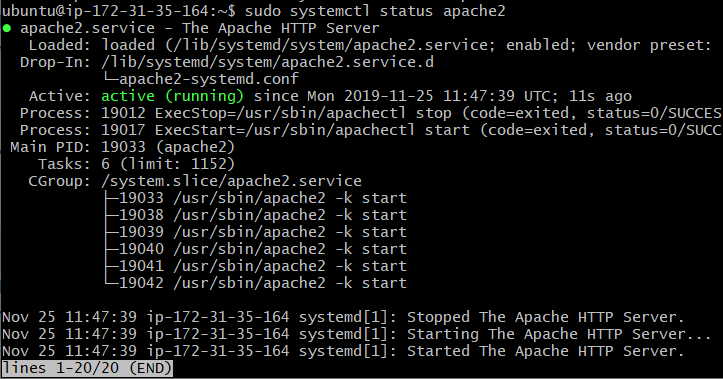

Ahora comprobaremos que estos cambios son eficaces. Para esto, crearemos un archivo de tipo **.php**, el mas útil de ellos es `info.php`:

    sudo nano /var/www/html/info.php
    

 
Esto creará una página en blanco donde escribiremos el siguiente código:
 
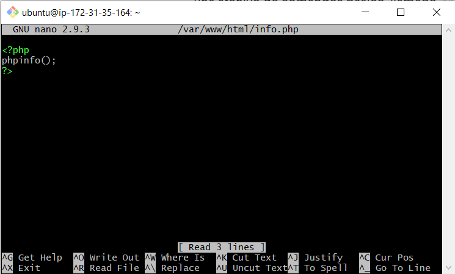

Cuando acabes guarda el archivo con `Ctrl+o` y sal de el con `Ctrl+x`.

Ahora podremos ver ese archivo en nuestro navegador escribiendo lo siguiente:

    http://ip_de_tu_servidor/info.php o http://dns_de_tu_servidor/info.php

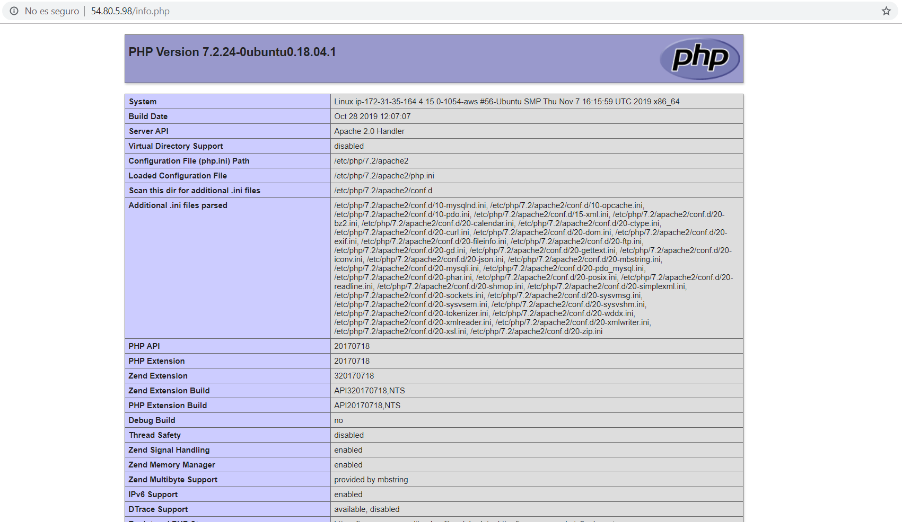

## Instalar phpmyadmin

Por último, instalaremos phpmyadmin para tener la interfaz gráfica de la base de datos y que nos resulte mas sencillo guardar los datos.

Primero ejecutaremos el comando de instalación:

    sudo apt-get install phpmyadmin php-mbstring php-gettext

Esto nos hará algunas preguntas que debemos rellenar:

### ¡Aviso! En el primer mensaje debemos seleccionar Apache2 pero aunque parezca que ya está seleccionado no lo está. Para seleccionarlo pulsa `espacio` una vez que estés sobre Apache2 y le saldrá un puntito. Ahora que si está seleccionado presiona `Tab` y después `Enter`.

Escoge **yes** en este otro mensaje:

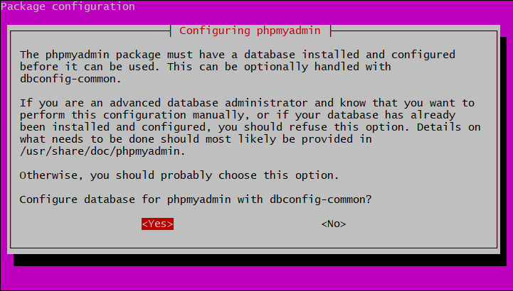

Ahora debería de pedirte que introduzcas una contraseña. La contraseña es probable que tenga que contener al menos una mayuscula, un caracter especial y algún numero. Además muy posiblemente tenga que tener mas de 8 caracteres.

Como siguiente paso debes confirmar esa contraseña:

También es posible que te salga alguno de los siguiente mensajes, responde de esta manera:

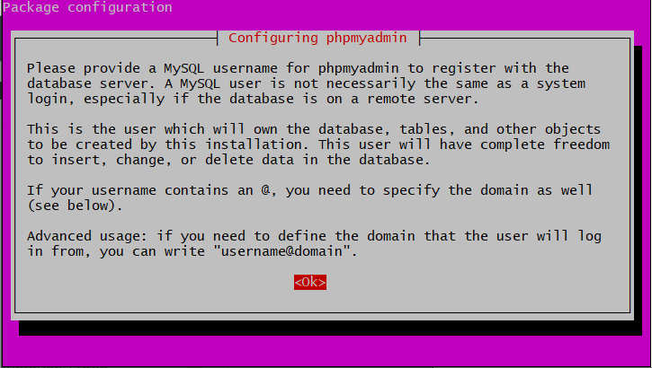

Este el nombre de usuario para tu **base de datos**.

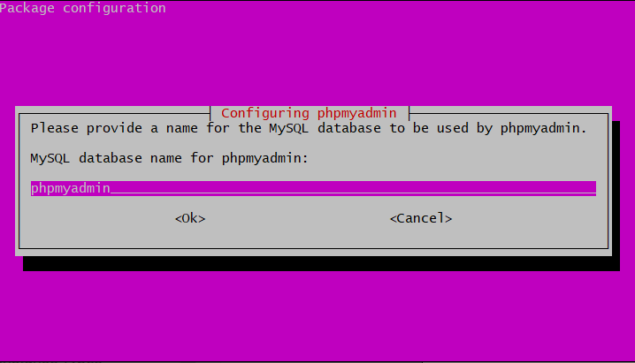

Este es el nombre de usuario de **phpmyadmin**.

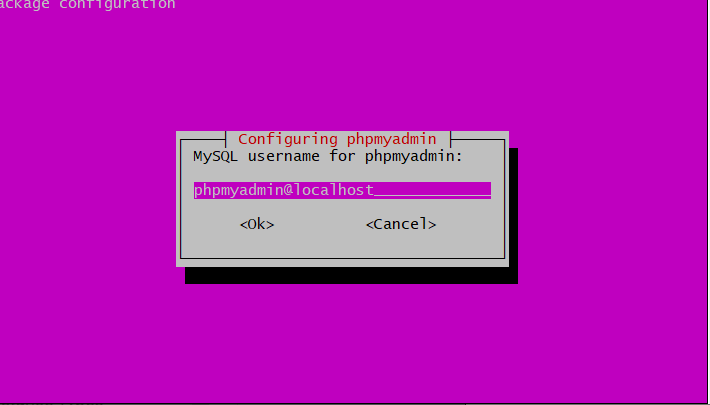

Aquí seleccionamos lo recomendado que es **Unix socket**.

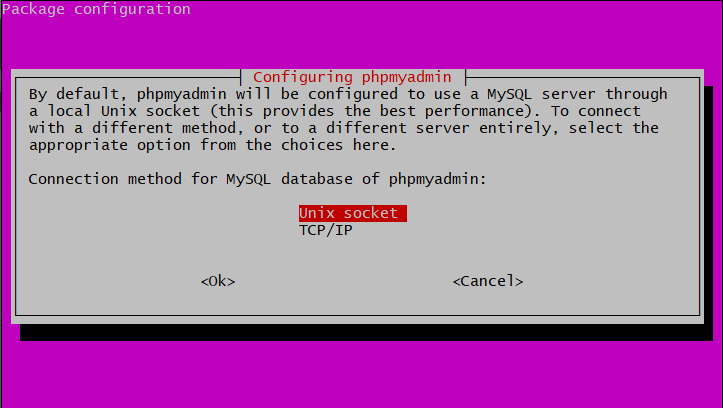

Ahora habilitaremos explícitamente las conexiones **PHP** con el siguiente comando:

    sudo phpenmod mbstring

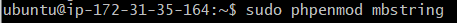

Para guardar los cambios reiniciaremos el servicio de apache:

    sudo systemctl restart apache2
    
Ahora podemos entrar a phpmyadmin desde el navegador de esta manera:

    http://ip_de_tu_servidor/phpmyadmin o http://dns_de_tu_servidor/phpmyadmin
    
Tendremos que iniciar sesión con el **nombre de usuario de phpmyadmin** y contraseña configuradas anteriormente:

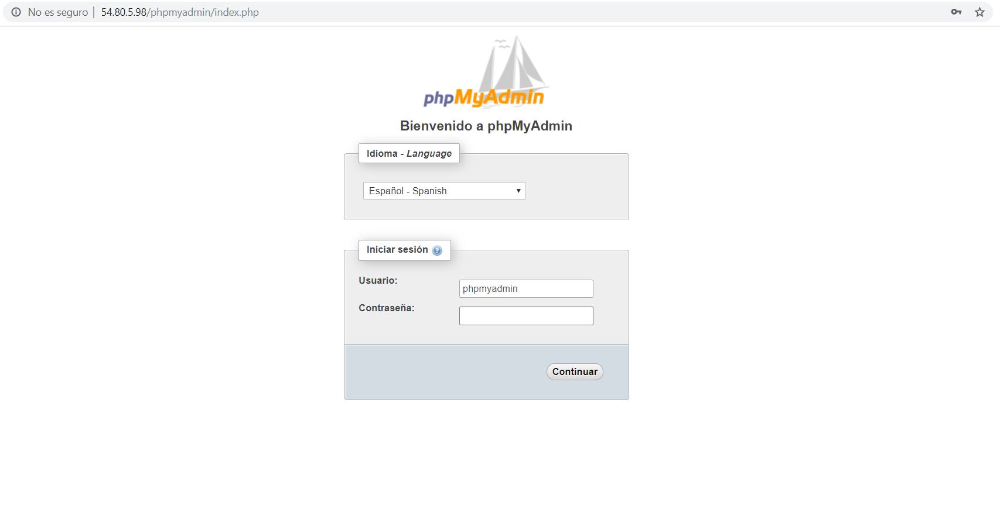

Ya estamos dentro y podemos editar nuestros datos:

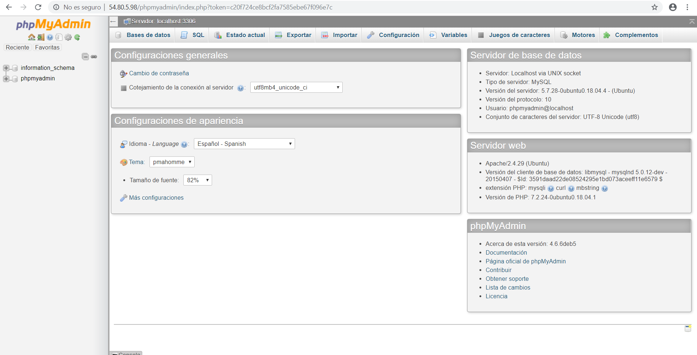
