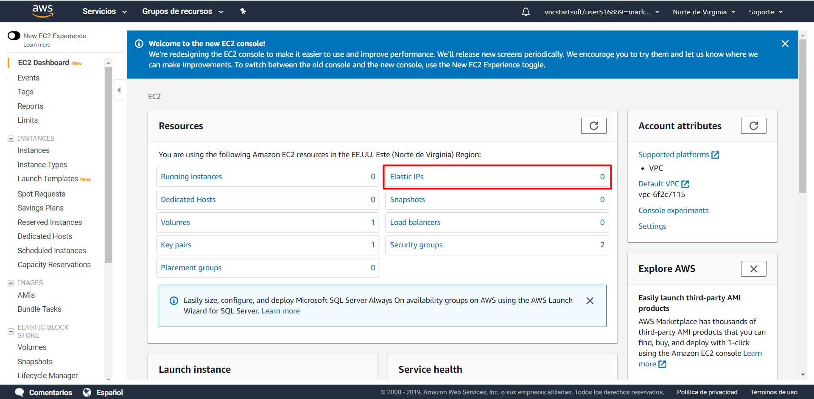
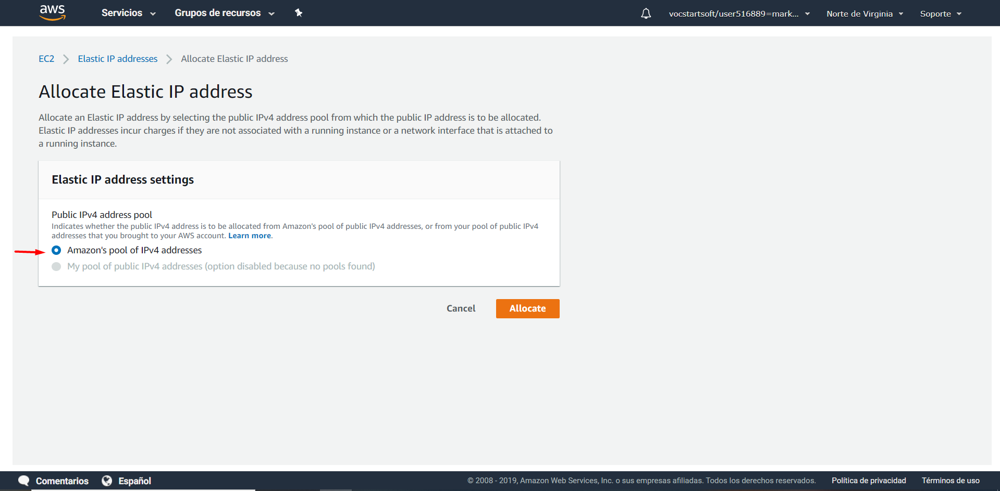
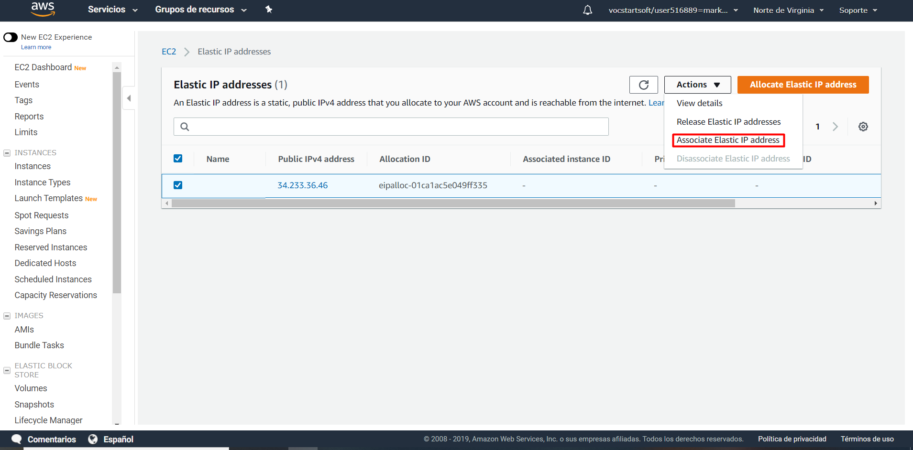
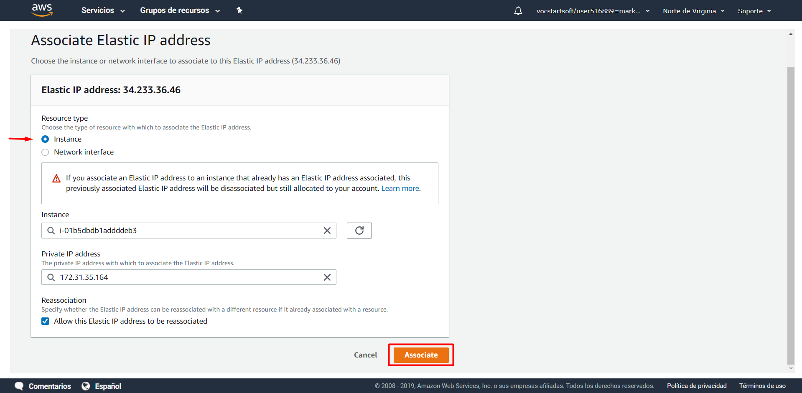
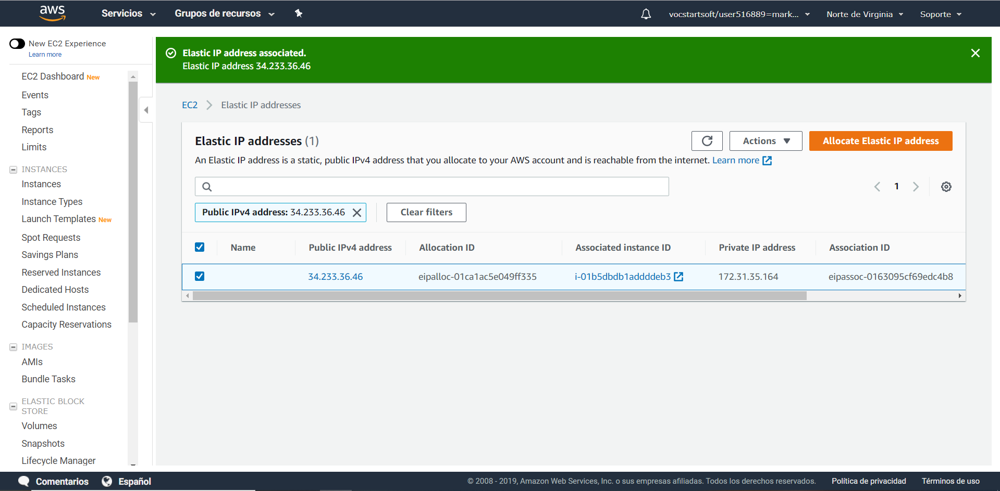
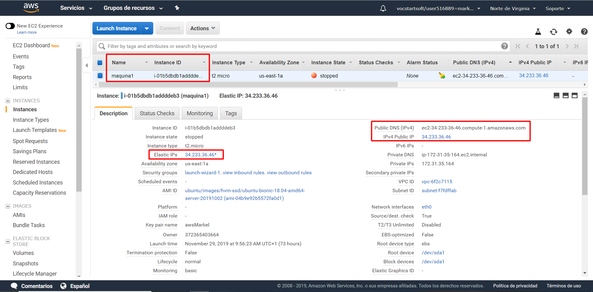

# IP Elástica.
En esta ocasión haremos que nuestra IP no varíe cada vez que encendemos la máquina virtual. 

Para conseguir esto completaremos dos pasos:

  - [Alquilar IP Elástica](#alquilar-ip-elastica)
  - [Asociar IP Elástica](#asociar-ip-elastica)

## Alquilar IP Elástica

Para empezar, en el **panel de navegación de aws** entraremos en `Elastic IPs`:
   

Una vez dentro clickaremos sobre cualquiera de las dos opciones donde pone `Allocate Eladtic IP Address`:

Nos saldrá una ventana para elegir si queremos una IP ofrecida por Amazon o si queremos una IP propia que tengamos previamente guardada.

Nosotros elegiremos `Amazon´s pool of IPv4 address` para que Amazon nos proporcione una IP:

Una vez seleccionada esa opción continuaremos clickando en `Allocate` y ya tendremos la IP elástica alquilada:

## Asociar IP Elástica

Una vez tengamos alquilada la IP elástica tenemos que asociarla con la máquina virtual que queremos usarla:
   

En la ventana de configuración configuraremos los datos seleccionando `Instance` en la primera opción y rellenando los campos con la ID e IP fija de nuestra máquina virtual:

Ahora ya tendríamos la IP Elástica asociada con nuestra máquina virtual:

Ahora podemos ver la IP asociada en los detalles de nuestra máquina virtual:

