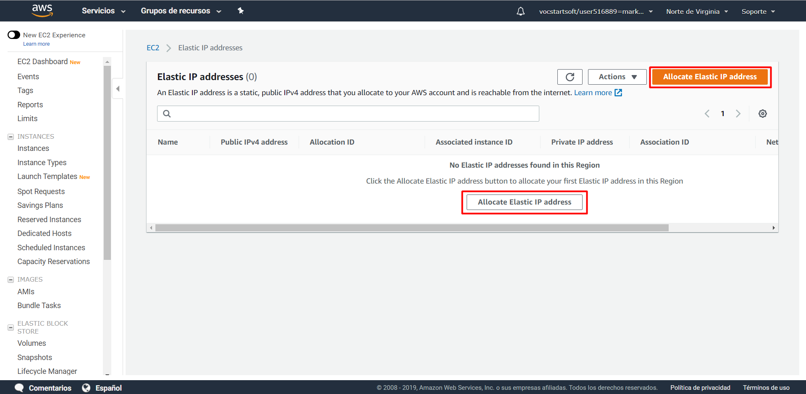

# IP Elastica.
En esta ocasión haremos que nuestra IP no varie cada vez que encendemos la maquina virtual. 

Para conseguir esto completaremos dos pasos:

  - [Alquilar IP Elastica](#alquilar-ip-elastica)
  - [Asociar IP Elastica](#asociar-ip-elastica)

## Alquilar IP Elastica

Para empezar, en el panel de navegación de aws entraremos en `Elastic IPs`:
   

Una vez dentro clickaremos sobre cualquiera de las dos opciones donde pone `Allocate Eladtic IP Address`:

Nos saldrá una ventana para elegir si queremos una IP ofrecida por Amazon o si queremos una IP propia que tengamos previamente guardada.

Nosotros elegiremos `Amazon´s pool of IPv4 address` para que Amazon nos proporcione una IP:

Una vez seleccionada esa opción continuaremos clickando en `Allocate` y ya tendremos la IP elastica alquilada:

## Asociar IP Elastica

Comenzaremos con el comando para instalar Apache2:

    sudo apt install apache2
   

Para comprobar que funciona correctamente primero accederemos al **wizard de AWS** para comprobar que HTTP y HTTPS están habilitados:

Una vez aquí clickaremos en `Edit`:
