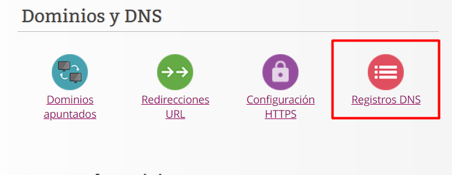

# GESTIÓN DE DNS

Para empezar, en la página principal de **Guebs** iremos a **Registro DNS**.

Una vez aquí crearemos el registro DNS rellenando con los datos requeridos, tales como:
  - Nombre: es lo que saldrá delante del dominio.
  - TTL: es el tiempo de respuesta del seervidor.
  - Tipo: es el tipo del registro que explicaremos mas abajo.
  - Dirección: es la dirección del registro DNS.

#### TIPOS DE REGISTROS
- Tipo A: Con este tipo asociamos un nombre a una dirección IP IPv4 para buscar esa direccón mediante un nombre en vez de una IP.
- Tipo AAAA: Este tipo es exactamente igual que el anterior pero para direcciones IPv6.
- Tipo CNAME: Se utiliza para asociar un nombre a una url para correr diferentes servicios (FTP y servidor web) con una sola dirección.
- Tipo TXT: Con este tipo asociamos un nombre a texto plano que contiene información externa a tu página.
- Tipo SRV: Es utilizado para asociar un nombre a un servicio.
