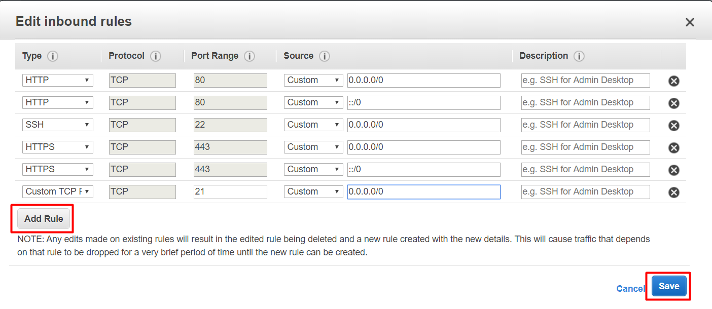

# Virtual Hosts

Primero entraremos al wizard para añadir el puerto 21.

Una vez aquí entrarems en **Inbound** y clickaremos sobre **Edit**.

Clickando sobre **Add Rule** podremos añadir un puerto mas, en este caso elegiremos **Custom TCP** con el puerto 21.

Cuando lo tengamos añadido guardaremos los cambios con **Save**.

Podremos ver que se ha añadido la nueva norma.

Ahora procederemos a **instalar el servidor ftp en linux**.

Para ello utilizareos este comando:

`sudo apt-get install vsftp`

Es recomendable hacer una copia del archivo de configuración para tener un archivo limpio en el que trabajar.

`sudo cp /etc/www/vsftp.conf /etc/www/vsftp.conf.original`

Ahora crearemos los usuarios de tipo ftp para asignarles una ruta de carpeta y que se dirijan a esa al hacer la conexión.

`sudo useradd -g ftp -d ruta_de_la_carpeta -c "comentario" nombre_usuario`

Al crear los usuarios de esta manera hay que asignarles una contraseña manualmente.

`sudo passwd nombre_usuario`

Ahora editaremos el archivo de configuración.

`sudo nano /etc/var/vsftp.conf`

Con ese comando accederemos al archivo en el cual tienen que aparecer las siguientes líneas sin comentar:

Una vez tengamos esas líneas saldremos del archivo con `Ctrl+O` y reiniciaremos el servicio:

`sudo service vsftpd restart`

