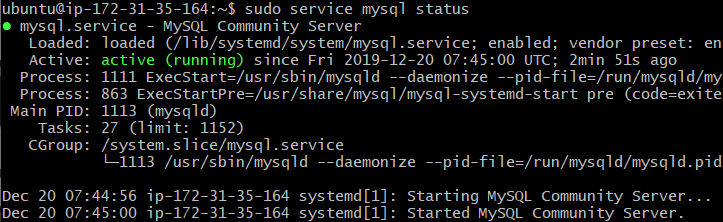
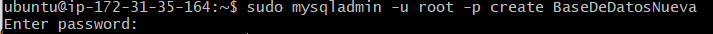
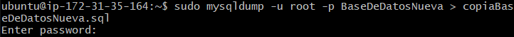

# Comprimir y empaquetar carpetas

El primer paso es comprimir y empaquetar las carpetas de cliente y servidor con el siguiente comando:

`sudo -cvfz nombre_del_archivo.tar.gz ruta_de_la_carpeta_a_comprimir`

Ahora comprobaremos quese han guardado bien con `ls`.

# Volcar y empaquetar base de datos

Primero comprobaremos que el servicio de **MySQL** este activo.

`sudo service mysql status`

En caso de no tener ninguna base de datos podemos crearla facilmente.

`sudo mysqladmin -u root -p create nombre_de_la_base_de_datos`

Una vez tengamos alguna base de datos la podemos bajar con el siguiente comando:

`sudo mysqldump -u root -p nombre_de_la_base_de_datos > nombre_del_archivo_de_descarga.sql`

Y ya tendríamos la base de datos. En caso de querer ver el archivo podriamos verla con `ls`. 
