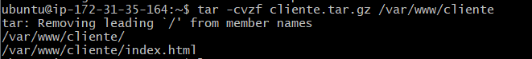
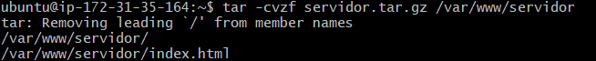

# Comprimir y empaquetar carpetas

El primer paso es comprimir y empaquetar las carpetas de cliente y servidor con el siguiente comando:

`sudo -cvfz nombre_del_archivo.tar.gz ruta_de_la_carpeta_a_comprimir`

Ahora comprobaremos quese han guardado bien con `ls`.

