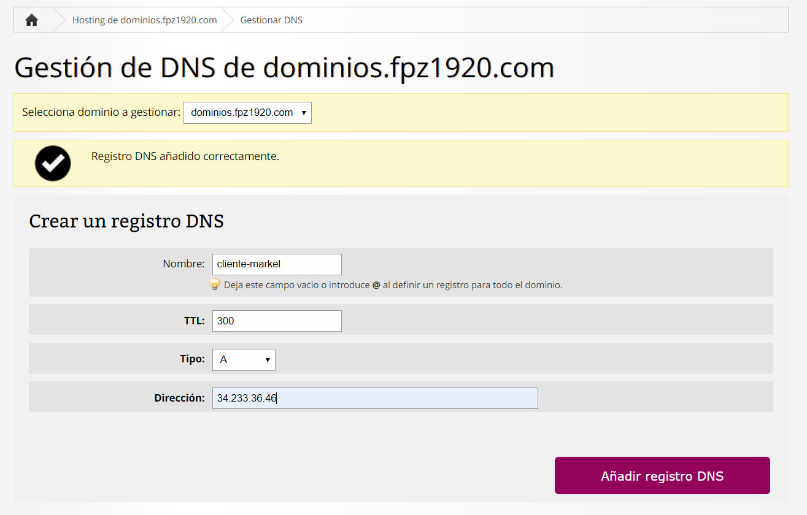
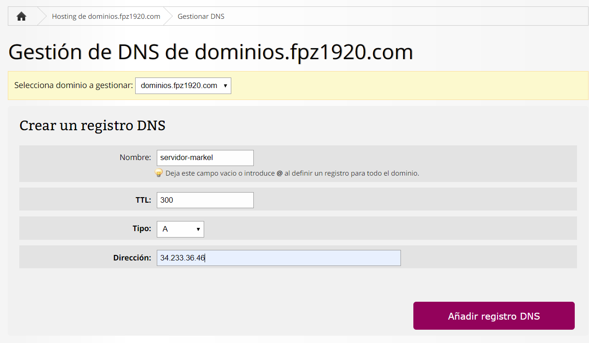
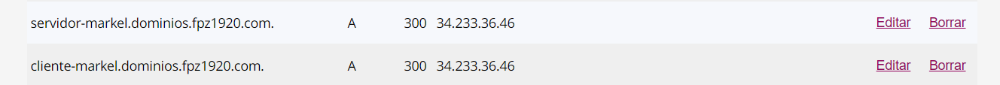
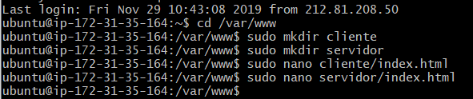
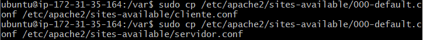
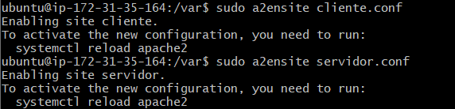
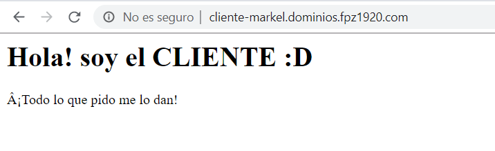
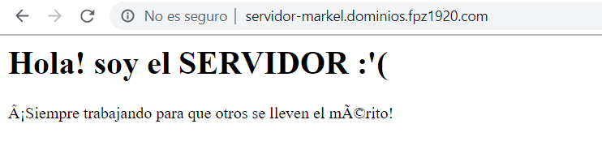

# Virtual Hosts

Primero crearemos los registros DNS (como en la tarea anterior).

En esta ocasión crearemos dos DNS, uno para el cliente y uno para el servidor.

Una vez creados los DNS crearemos una carpeta para el cliente y otra para el servidor (con sus respectivos index).

Ahora tenemos que darle los permisos correctos a la carpeta **www**.

Seguidamente crearemos copias de los archivos de configuración para editar uno para el cliente y otro para el servidor.

Es hora de editar cada archivo con el **ServerName** adecuado (el del registro DNS) y cambiar el **DocumentRoot** a la carpeta.

Una vez configurados los archivos debemos habilitar esa configuración con el siguiente comando

`sh sudo a2ensite cliente.conf`

Por último reiniciaremos el apache para que los cambios se guarden.
`sh sudo systemctl restart apache2`

Ahora buscando en el navegador con el DNS creado nos deberian de salir los index.

