# Automatizar copias de seguridad

El primer paso es acceder a la ubicación donde guardaremos las copias de seguridad para crear ahi el script que los creará.

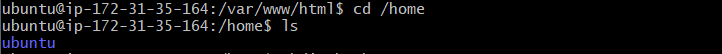

Una vez aquí crearemos la carpeta para guardas las copias y el script.

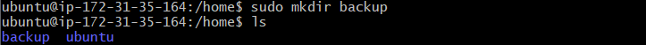

Para crear el script accederemos a la carpeta recien creada y ejecutaremos el siguiente comando:

`sudo nano script.sh`

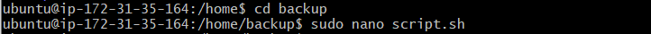

Al ejecutar el comando nos abrirá el archivo para escribir las líneas del script.

Ahora accederemos a la ubicación donde estara el ejecutable que iniciará el script.

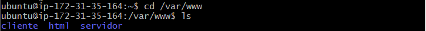

Al entrar crearemos el ejecutable:

`sudo nano script.php`

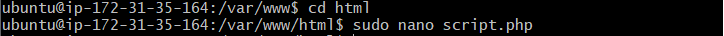

En el archivo escribiremos las líneas pertinentes.

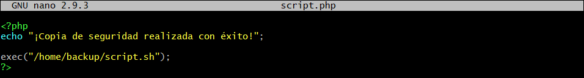

Una vez hecho esto le daremos los permisos necesarios a la carpeta donde  esta el **.php**.

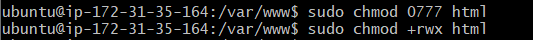

También daremos los permisos necesarios a la carpeta donde esta el script.

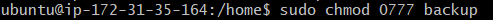

Por último cambiaremos el propietario de la carpeta donde está el script.

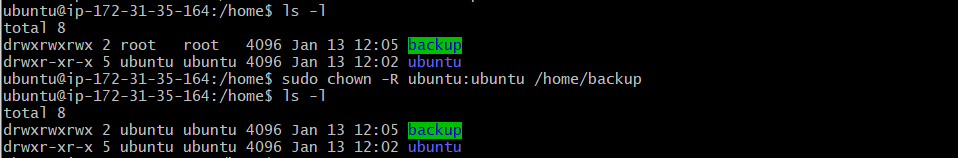

# Borrado automatico de los backups

Primero crearemos el archivo de crontab con el siguietne comando:

`crontab -e`

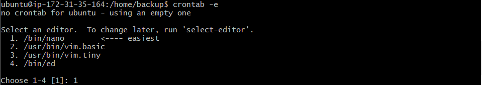

Finalmente añadiremos las líneas que efectuan el borrado de archivos de más de 7 días.

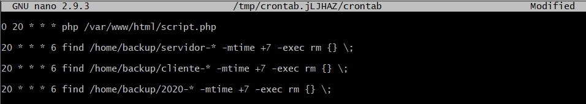
